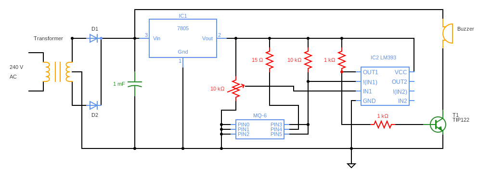

# LPG Gas Leakage Detection System

## Project Overview
This project is designed to detect LPG gas leakage using the MQ6 sensor. When the gas concentration exceeds a certain threshold, the system triggers an alert using a buzzer. The LM393 comparator processes the sensor signal, and a 7805 voltage regulator ensures a stable power supply. The system is ideal for safety applications in households and industries.

## Circuit Diagram

## Key Components Used
- **MQ6 Gas Sensor** - Detects LPG gas concentration in the air.
- **Buzzer** - Provides an audible alert when gas leakage is detected.
- **LM393 Comparator IC** - Compares the sensor output and activates the alarm.
- **7805 Voltage Regulator IC** - Converts 12V DC to 5V DC for circuit stability.
- **Transformer (240V AC to 12V DC)** - Steps down mains voltage for safe operation.
- **Resistors, Capacitors, and Diodes** - Supporting components for circuit operation.

## Features
- **Real-time LPG Gas Detection**  
- **Audible Alert via Buzzer**  
- **Comparator-based Signal Processing**  
- **Stable Power Supply using 7805 Regulator**  
- **Safe Operation with Transformer-based Power Conversion**

## Working
- AC 230V, 50Hz input is provided to the circuit. Through step down transformer AC-230V is converted to AC - 12V. 
- 1N4007, PN junction rectifier diode, connected across the transformer converts 12V AC current to DC.
- Then IC7805 restricts the voltage to 5V from 12V and gives additional safety to our circuitry.
- These 5V serve as input to sensitive semiconductor Gas sensor MQ-6.
- In clean air, it gives low voltage and when the gas concentration increases, output voltage also increases accordingly.
- Comparator LM393 compares whether the output voltage of MQ 6 exceeds threshold value or not.
- If it exceeds, buzzer will start beeping and a alert will be given to the user about the leakage of gas

## How to Use
1. **Power the System**  
   - Connect the circuit to a 12V DC power source.  
   
2. **Gas Leakage Detection**  
   - If the MQ6 sensor detects LPG gas beyond a threshold, the LM393 comparator triggers the buzzer.  
   
3. **Safety Measures**  
   - Upon hearing the alarm, ventilate the area and turn off any potential gas sources.  

## Reference link
https://drive.google.com/file/d/1ZGqQU33oLNJbJru9kzSGWllwNGwAHyw0/view?usp=drive_link